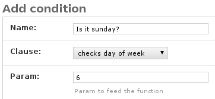

.. django-clausula documentation master file, created by
   sphinx-quickstart on Sun Jul 29 22:04:41 2012.
   You can adapt this file completely to your liking, but it should at least
   contain the root `toctree` directive.

Welcome to django-clausula's documentation!
===========================================

Name
----

"Clausula" means "condition" in Latin.

The purpose of this app is to allow adding dynamic conditions to relations
between objects.

How is this useful?
-------------------

Let's say you develop an application that will present content to user based
on various conditions. Gamification comes to mind. Let's say you want to set
the conditions on a per-user or per-group basis. For example girls get happy
hours on Saturday and boys get them on Thursdays. Hardcoding that would be a
bit tricky if you tend to change your mind frequently.

.. `Clausula` is meant to be a glue between models (which are concrete) and
    condition statements. It allows you to concretize your abstract clauses and
    save them as objects to database. Such objects can be then injected in
    relations between other objects.

Usage
-----

After installing the package and adding 'clausula' to INSTALLED_APPS
you should define some abstract conditions you'd like to use.

Do this by creating a file ``conditions.py`` in your app. Then you need to
import ``clauses`` registry, define your conditions and register them.

Each condition is simply a function that fullows these rules:

* it takes one mandatory argument: an ``object`` (a :class:`Condition` instance)
* it silently accepts any number of optional arguments (*args, **kwargs)
* it returns a boolean value

The ``object`` is guaranteed to have a ``param`` attribute which holds a string
which can be used to compute returned boolean value. There can also be some
relations available as :class:`Condition` subclasses :class:`django.db.models.Model`.
Feel free to experiment and find some hackish uses for this package.

Full example
------------

You run a virutal pub and want to have lower prices on one day.

``conditions.py``:
    .. literalinclude:: ../example_project/brew/conditions.py
       :linenos:

Now let's see our ``models.py``:
    .. literalinclude:: ../example_project/brew/models.py
       :linenos:

A bit of sugar in ``admin.py``:
    .. literalinclude:: ../example_project/brew/admin.py
       :linenos:

Then you should run ``./manage.py syncdb && ./manage.py runserver``, go to the admin page and add
a Condition. You'll see "checks day of week" in :class:`Clause` list. Fill the name
and give a day number. Let's say we want to add a :class:`Condition` that triggers on Sunday:

You should also add a Beverage with redeem triggered by your "On Sunday" condition.

This is an example template to see if it works:
    .. literalinclude:: ../example_project/brew/templates/brew/beverage_list.html
       :language: django
       :start-after: <body>
       :end-before: </body>
       :linenos:

All that's left is ``urls.py`` to tie it all together - let it be an exercise for you ;)
Anyway you can always just fire ``./manage.py runserver`` from the ``example_project``
directory and browse to ``http://127.0.0.1:8000/brew/`` :)

.. TODO: Add inclusion template tag as this case may be common.

Now play with ``param`` and check if it works properly. Add some more objects.
Try writing another function and swap it with the one you used in example.
Does it trigger properly? Experiment.

Feedback
========

If you have any ideas how to extend functionality of this little package,
`fork it on github <https://github.com/dekoza/django-clausula>`_ and make
a pull request or simply `file a feature request <https://github.com/dekoza/django-clausula/issues>`_.

Versioning
==========

I'd like to follow Semantic Version guidelines.

Releases will be numbered with the following format:

``<major>.<minor>.<patch>``

And constructed with the following guidelines:

* Breaking backward compatibility bumps the major (and resets the minor and patch)
* New additions without breaking backward compatibility bumps the minor (and resets the patch)
* Bug fixes and misc changes bumps the patch
* Major version ``0`` means early development stage

For more information on SemVer, please visit http://semver.org/.

Autodoc
=======

.. toctree::
   :maxdepth: 2

   autodoc

Indices and tables
==================

* :ref:`genindex`
* :ref:`modindex`
* :ref:`search`

